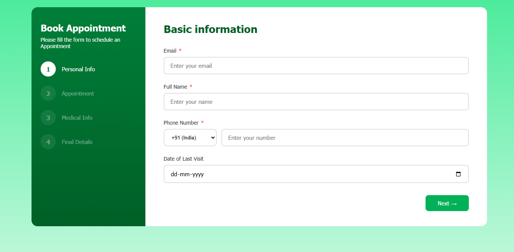
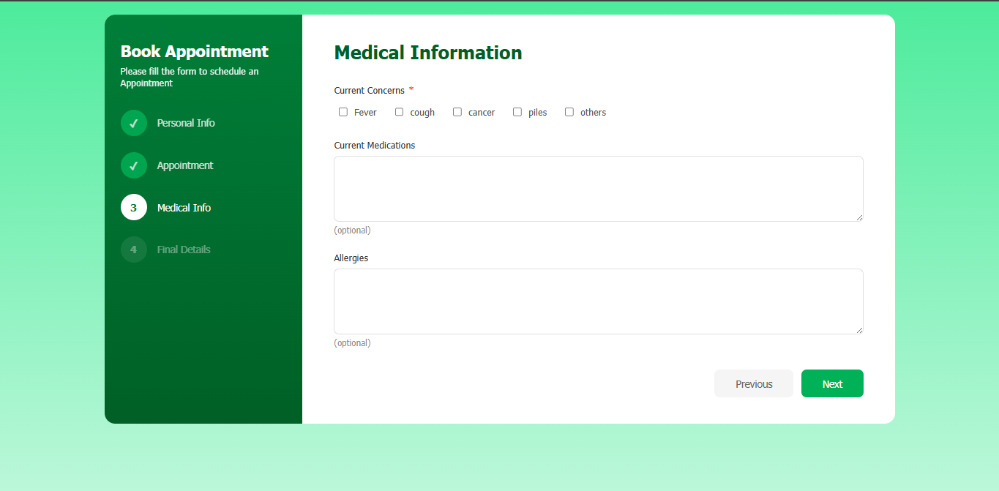
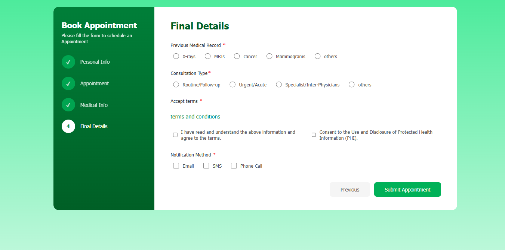

# Medical Appointment Booking Form 

***Project Strture:***

    📁 Layouts
        🗄️ termsAndCondition.html
    📁 Styles
        🗄️ style.css
    📁 scripts
        🗄️ error.js
        🗄️ formData.js
        🗄️ localDb.js
        🗄️ scripts.js
        🗄️ validation.js
    🗄️ index.html
---

**About Each page**

    🗄️ termsAndCondition.html : 
        code of terms and condition
    🗄️ style.css
        all css about layout and st.
    🗄️ error.js
        unifired Error Function
    🗄️ formData.js
        All Data of form fields 
    🗄️ localDb.js
        All the things about local storage
    🗄️ scripts.js
        Main functions 
    🗄️ validation.js
        All form validataion function

---

**Images**

